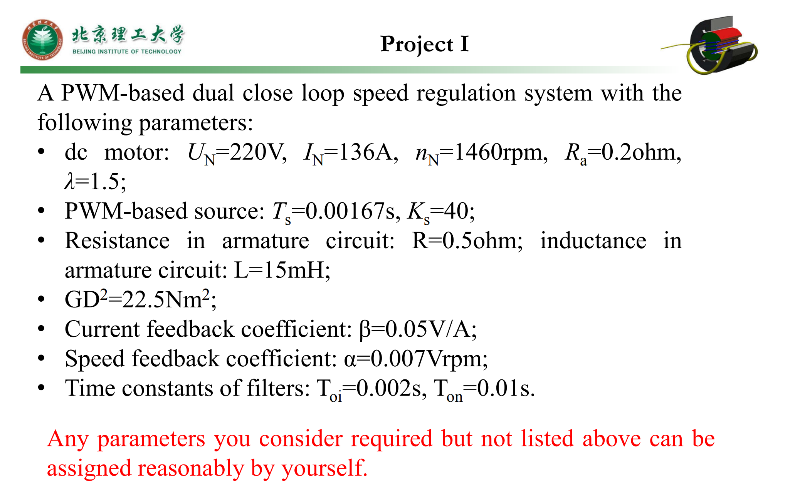
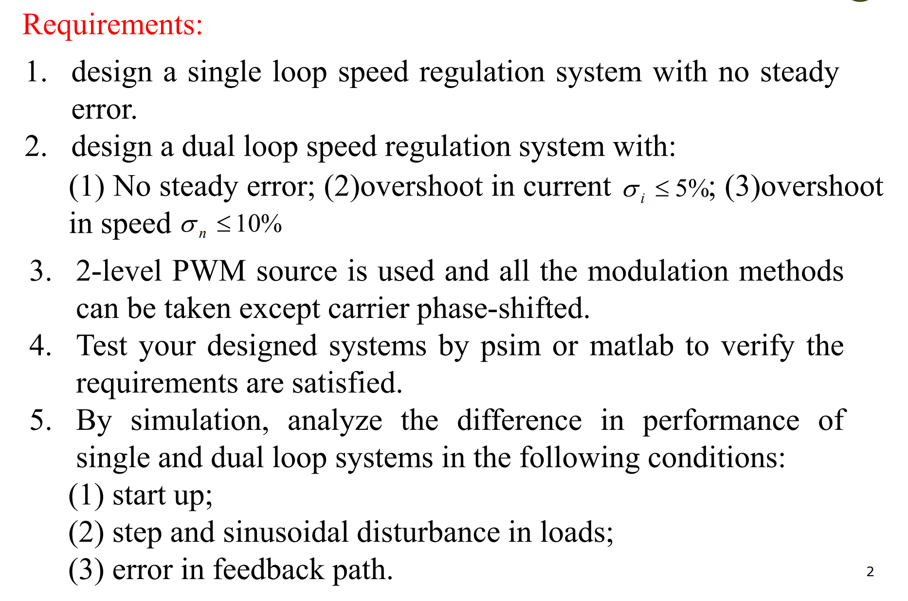
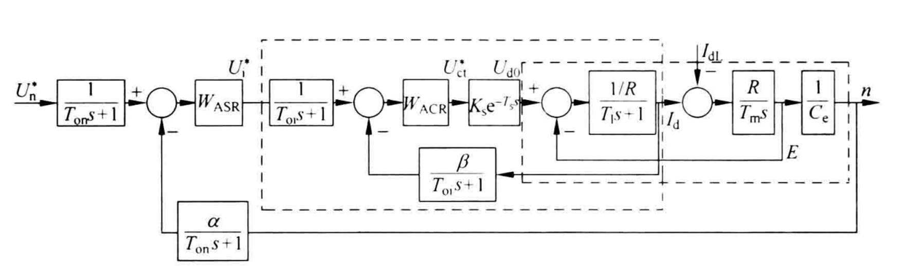
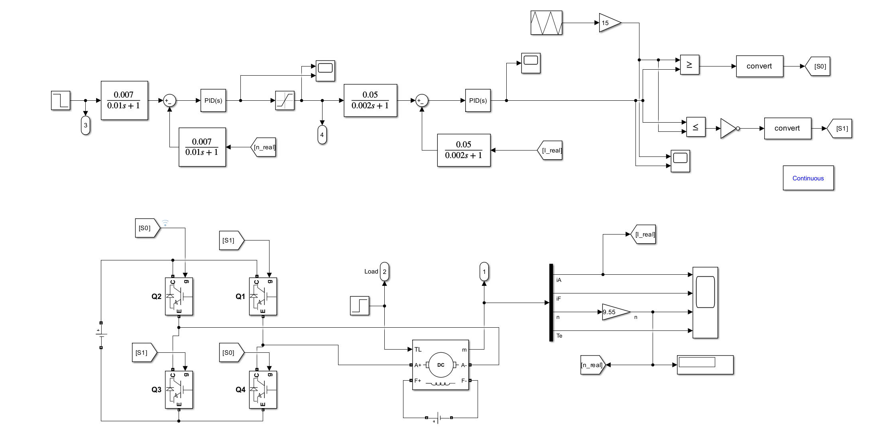
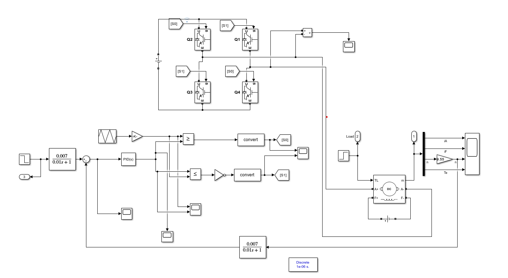

# DC-Motor-Simulation

This is a collection of DC motor speed control simulation, including single(speed) loop and Dual(speed and current) loop speed control. 

## Requirement for matlab

Matlab/Simulink 2023b

## Project review

This Project investigates DC motor drive systems, focusing on single-loop and dual-loop speed control systems, and simulates their behavior using Matlab Simulink. Our aim is to analyze and compare the performance of these two types of DC motor drive systems.

### Requirment

### Motor parameters

Dc motor:

| Un   | In   | nN      | Ra     | $\lambda$ |
| ---- | ---- | ------- | ------ | :-------: |
| 220V | 136A | 1460rpm | 0.2ohm |    1.5    |

PWM source:

| Ts       | Ks   |
| -------- | ---- |
| 0.00167s | 40   |

Armature circuit:

| R      | L    |
| ------ | ---- |
| 0.5ohm | 15mH |

$GD^2=22.5N\cdot m^2$ and $J=m\rho^2=\frac{GD^2}{4g}$

Current feedback coefficient: β=0.05V/A;

Speed feedback coefficient: α=0.007V/rpm;

Time constants of filters: Toi=0.002s, Ton=0.01s.

### Block diagram

### Simulink model for single-loop control

### Simulink model for dual-loop control

`Results_Analysis_singleloop.m` is used to analyze the results after running `DCmotor_single_loop.slx`.

`Results_Analysis_comparasion.m` is used to analyze the results after running `DCdualLoop_SinlgeLoop_Comparasion.slx`.

`Results_Analysis_dualloop.m` is used to analyze the results after running  `DCdualLoop.slx`.
