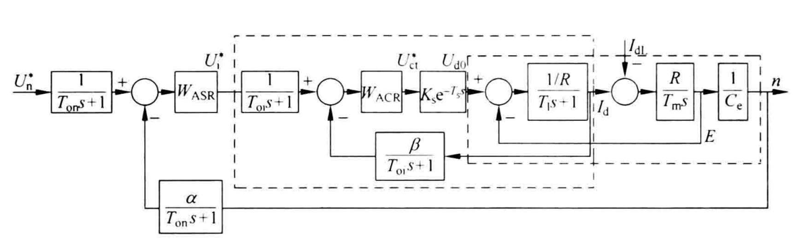

# DC-Motor-Simulation
This is a collection of DC motor simulation using matlab simulink , from starting a DC motor to double close loop of DC Motor with PWM. 

## [multistage starting](Project/multistage-starting/DC_motor_multi_starting.slx)

Simulink model:

Multistage switch:

Results

## [Single loop control( PWM based)](Project/single-loop-control-PWM/DCmotor_single_loop.slx)

Simulink model:

Results:

## [Dual loop( speed and current) motor control](Project/dual-loop-control-PWM/DCdualLoop.slx)
Simulink model:

Results:

## Project with specific requirment

### Requirment

### Motor parameters

Dc motor:

| Un   | In   | nN      | Ra     | $\lambda$ |
| ---- | ---- | ------- | ------ | :-------: |
| 220V | 136A | 1460rpm | 0.2ohm |    1.5    |

PWM source:

| Ts       | Ks   |
| -------- | ---- |
| 0.00167s | 40   |

Armature circuit:

| R      | L    |
| ------ | ---- |
| 0.5ohm | 15mH |

$GD^2=22.5N\cdot m^2$ and $J=m\rho^2=\frac{GD^2}{4g}$

Current feedback coefficient: β=0.05V/A;

Speed feedback coefficient: α=0.007V/rpm;

Time constants of filters: Toi=0.002s, Ton=0.01s.

Block diagram:

