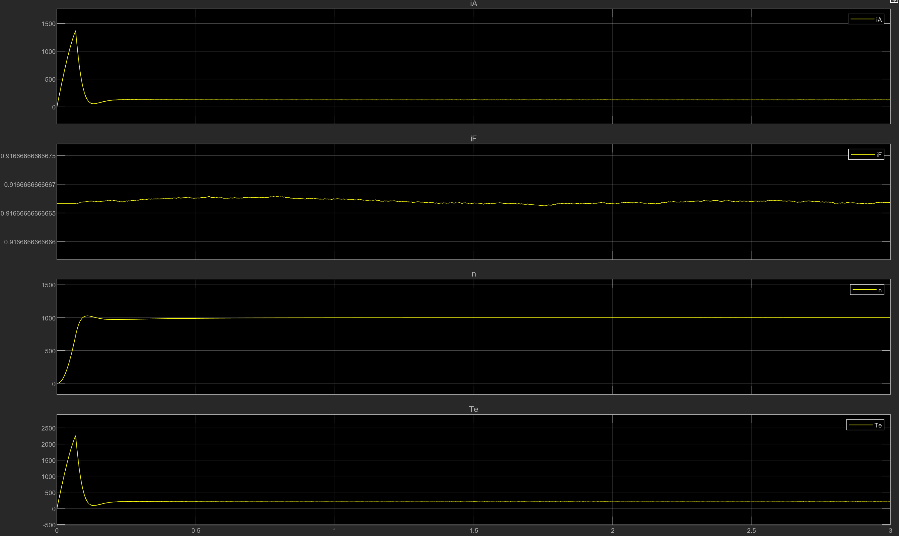

# DC-Motor-and-Simulation
This is a collection of DC motor simulation using matlab simulink , from starting a DC motor to double close loop of DC Motor with PWM. 

## multistage starting

Simulink model:

Multistage switch:

Results

## [Single loop control( PWM based)](Project/single-loop-control-PWM/DCmotor_single_loop.slx)

Simulink model:

Results:

## [Dual loop( speed and current) motor control](Project/dual-loop-control-PWM/DCdualLoop.slx)
Simulink model:

Results:

